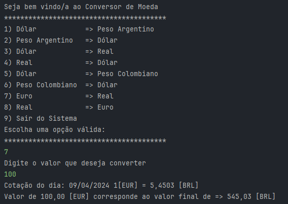

# ONE - Oracle Next Education Challenges.
Challenge desenvolvido para Formação de Java do Programa ONE.

## Conversor de Moedas - ( em desenvolvimento )
###  Sobre o Desafio

- Desenvolver um Conversor de Moedas que ofereça interação textual (via console) com os usuários, proporcionando no mínimo 6 opções distintas de conversões de moedas em um menu. A taxa de conversão não será estática, mas sim dinamicamente obtida por meio de uma API, garantindo dados precisos e em tempo real para uma experiência mais atualizada e eficaz. 

### Tela do Aplicativo
 

