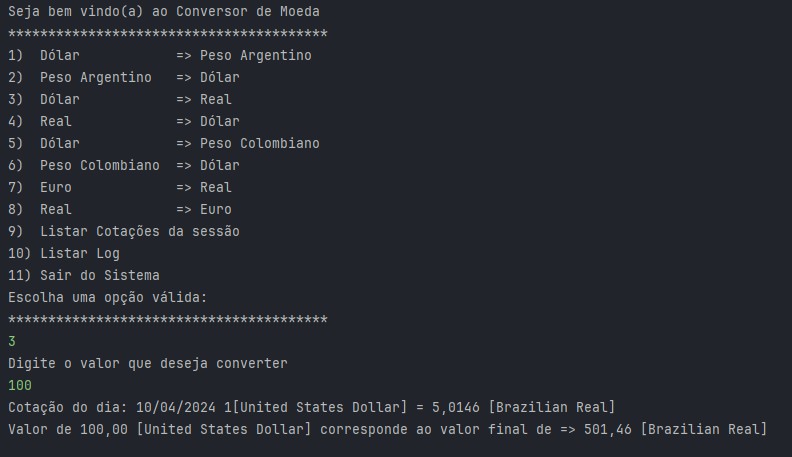
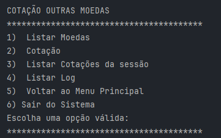
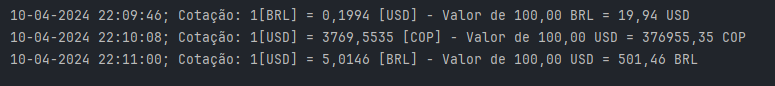

# ONE - Oracle Next Education Challenges.
Challenge desenvolvido para Formação de Java do Programa ONE.

## Conversor de Moedas
###  Sobre o Desafio

- Desenvolver um Conversor de Moedas que ofereça interação textual (via console) com os usuários, proporcionando no mínimo 6 opções distintas de conversões de moedas em um menu. A taxa de conversão não será estática, mas sim dinamicamente obtida por meio de uma API, garantindo dados precisos e em tempo real para uma experiência mais atualizada e eficaz. 
- Possibilidade de escolher qualquer moeda digitando a sigla.
- Tratamento de erros e entradas inválidas. 

### Tela e Funcionalidades do Aplicativo

- Menus :
 

- Consulta do arquivo de log :  

